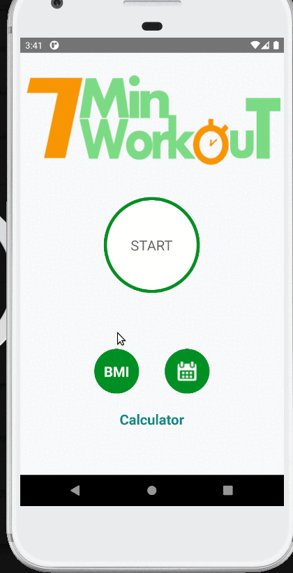

# 7MinutesWorkout

Simple workout app.

<h3>User can:</h3>

- check history of completed trainings as list or chart,
- calculate BMI in metric and US units,
- perform 12 exercises with rest period,
- sound is played at the beginning and end of exercise.

<h3>Used technologies:</h3>

- CountDownTimer,
- MediaPlayer,
- TextToSpeech,
- RecyclerView,
- radio button,
- Sqlite,
- chart with MPAndroidChart library,
- finding views from layout with view binding.

<h3>App screenshots:</h3>

App start screen          |  App end screen
:-------------------------:|:-------------------------:
  |   
 

BMI Calculator         |  Workout
:-------------------------:|:-------------------------:
  |   
 
<h3>App during usage:</h3>

BMI calculation         |  Workout | History
:-------------------------:|:-------------------------:|:-------------------------:
  |  |  
